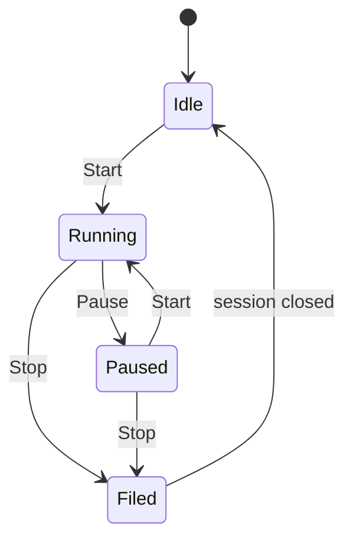

# Feature: Project time tracking

Date: 2026-10-06

## What it does

Staff on the active team share a list of named projects. Each person logs only their own hours, with a server-side timer or a finished duration they type in. Clients do not see this. Hours are not tied to a client or an invoice.

## Behavior

- A project is a name on the team in `X-Team-Id`. Any member can create one and rename one. Duplicate names are allowed. There is no delete and no client field.
- Time belongs to the signed-in user. Lists and totals are that person's rows. A teammate cannot read or stop the session.
- **Start** opens or resumes a session. **Pause** holds accumulated seconds and leaves the session open. **Stop** closes it and adds the duration to the finished total. Running time stays out of that total until Stop.
- One running timer per user. Starting another project pauses the current one. Pause and resume do not double-count. Nothing auto-stops at midnight.
- **Add time** records a finished block: date (default server UTC today), duration as integer seconds greater than zero, and an optional note. It does not start the timer. There is no in-place edit (`PATCH` and `PUT` on an entry are 405). The owner can delete their own finished row.
- The server clock wins. A backward clock adds 0 seconds for that segment. Stopping in the same second can file `duration_seconds` 0. A manual entry of 0 is 422.

Missing `X-Team-Id` is 400. A missing token is 401. A non-member is 403. A project on another team is 404.

## API

All of these need a staff JWT and `X-Team-Id`. Entries and sessions are personal.

| Method | Path | Auth | Notes |
| ------ | ---- | ---- | ----- |
| GET | `/api/projects` | staff | Team list, ordered by name. Each row includes the caller's finished seconds and open session |
| POST | `/api/projects` | staff | `{ name }`. 201. Blank name rejected. Duplicates allowed |
| GET | `/api/projects/{id}` | staff | 404 if missing or another team |
| PATCH | `/api/projects/{id}` | staff | Rename `{ name }`. No delete route |
| GET | `/api/projects/{id}/entries` | staff | Caller's finished entries only |
| POST | `/api/projects/{id}/entries` | staff | Manual add. `work_date` optional (server UTC today). `duration_seconds` integer > 0. Optional `note` |
| DELETE | `/api/projects/{id}/entries/{entry_id}` | staff | Own finished row. 204. Someone else's row is 404 |
| GET | `/api/projects/{id}/timer` | staff | Caller's open session on this project. 404 if none |
| POST | `/api/projects/{id}/timer/start` | staff | Start or resume. Pauses any other running session for this user first |
| POST | `/api/projects/{id}/timer/pause` | staff | Adds the current segment to accumulated seconds. Does not file the entry |
| POST | `/api/projects/{id}/timer/stop` | staff | Files the entry (`source: timer`, `work_date` = server UTC today) |

## UI

Staff only. Signed-out `/projects` redirects to login.

- Sidebar **Projects**, next to Clients and Meetings.
- `/projects` — create by name, rename in the row, finished total and live session for the signed-in user. The name links to the project.
- `/projects/:id` — **Start**, **Pause**, and **Stop** as three buttons; **Add time** (date, hours/minutes/seconds, note); table of finished entries with **Delete**. Reload keeps a running timer. Live elapsed moves; Finished stays until Stop.

## Files

- `backend/app/models/project.py` — `projects`, `time_entries`
- `backend/app/schemas/project.py`
- `backend/app/services/project_time.py` — server clock, one running timer, pause/stop
- `backend/app/api/projects.py`
- `backend/alembic/versions/006_projects.py`
- `frontend/src/pages/ProjectsListPage.tsx`
- `frontend/src/pages/ProjectDetailPage.tsx`
- `frontend/src/components/SessionElapsed.tsx`
- `frontend/src/layouts/StaffLayout.tsx`
- `frontend/src/App.tsx`

## Follow-ups / out of scope

No client link, invoice line, rate, billable flag, team total, archive, or project delete. No edit of a finished entry. No reminder when a timer runs overnight. Overlapping manual blocks are allowed.

Delivery: [feature-project-time-tracking.md](../delivery/feature-project-time-tracking.md). Issues #19–#22.

Return to [documentation hub](../README.md) · [Main README](../../README.md)
